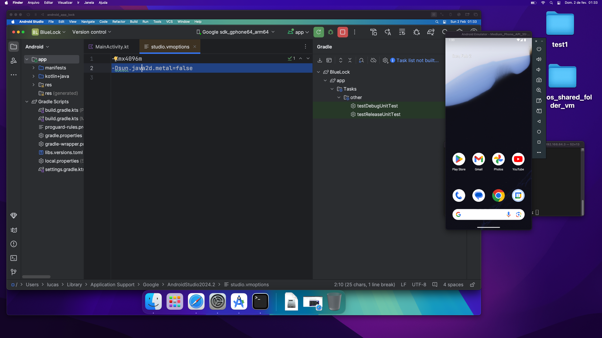

# Safe Android Development inside Virtual Machines

You should always develop your projects inside VMs. You should still review packages, but always install them inside a VM for a specific project. Don't install stuff in your main machine for security reasons but also so you don't pollute it.

The tutorial below is how I made it work in a macOS guest in UTM, on a macOS host, on a macbook air m3, but it works for ubuntu with ubuntu host (x64 currently, as Android Studio is not available for arm linux yet).


Android Studio running on the UTM macOS guest, Android Emulator running on the macOS host, and the terminal doing the SSH reverse port forwarding.

# Step 1: Install Android Studio on host and guest

You should have Android Studio on the host and guest, installed. For the host, you actually only need the Android Emulator, but the easiest way is to install Android Studio all along (you might be able to extract the emulator only, somehow, but it's not needed).

# Problem: How to launch apps on the emulator

The first problem is how to run the apps. Android emulator will not work inside the VM, but you can SSH from the host to the guest, with a reverse port forwarding of 5037 which is the android ADB port. Do, on the host:

```
ssh -R localhost:5037:localhost:5037 user@192.168.64.3
```

Where that IP is the IP of the VM (the guest).


You might get some tcp errors like `setsockopt TCP_NODELAY: Invalid argument` but they are not a problem.

This reverse port forwarding makes the port 5037 on the host appear as the 5037 port in the guest, so the guest thinks it's accessing the emulator on the same machine.

Now, open Android Studio on the host, you don't need to open a project, you can simply launch Android Device Manager and then launch the emulator with a phone.
Now, on the guest, launch Android Studio and see if you can connect the phone on the host. If it does not appear, try, on the guest:

```
./Library/Android/sdk/platform-tools/adb kill-server
```

If it still don't appear, try on the host to turn off the phone and launch it again. A combination of these 2 tricks on the right order makes it work.

Since Apple's new virtualization framework still does not support USB passthrough, this is your only option. Now, connecting a phone to the host should also make it appear on the guest (untested).

# Poor UI performance on Android Studio

Android Studio uses some weird GPU rendering. Intellij IDEA already fixed this problem but it's harder to make it work for Android, it's better to use Android Studio. To fix Android Studio's bad performance, add

```
-Dsun.java2d.metal=false
```

in the case of macOS guest, and 

```
-Dsun.java2d.opengl=false
```

in the case of a linux guest (untested).

on `studio.vmoptions` (on the guest) either in the Android Studio folder next to the studio.sh or by doing `Help -> Edit Custom VM Options` and then restart Android Studio.

# Flutter Development

Flutter requires some extra redirection for the VM service.

On the host, do

```
ssh -R localhost:5037:localhost:5037 -R localhost:50300:localhost:50300 vm@192.168.64.8
```

And on Android Dtudio Flutter's configuration for flutter run add the following flags:

```
--host-vmservice-port=50300 --dds-port 50301
```
